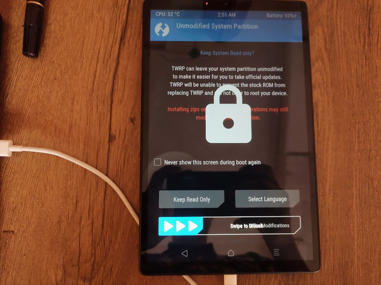

# X606F Android Kernel (ACHILLES6 ROW WIFI)

## Overview

Unfortunately this project is dead. I have broken 2 devices while attempting to get an Android kernel working on the X606F and while it came close, I made a number of fatal mistakes.

The first mistake is not having a proper debugging setup. If I were to do this again, I would try to get a proper USB EHCI debugging cable. I do not know exactly if the X606F's USB controller is capable of supporting this EHCI dbug protocol, but I *have* gotten Gadget USB Serial mode working. That has not proven to be good enough, as it doesn't support early printk debugging, but the EHCI debugging *should* support all of that.

If you have some financial means, wish to see recent Linux kernels running on Lenovo Tablets or other Mediatek tablets, with all the latest bells and whistles like KernelSU, and wish to help this project, please [get in touch](pitwuu@gmail.com).

## The LCM MIPI Interface

The X606F has various LCD's. For a driver supporting the NT36523w, check out the folder in the LCM driver.

 * [nt36523w](https://github.com/sinetek/android_kernel_lenovo_achilles6/tree/main/drivers/misc/mediatek/lcm/panel_mipi_nt36523w_inx_video_1200p).

## How to Contribute to the Project

Contributions are more than welcome! Please head over to the discussion thread [xdadevs](https://forum.xda-developers.com/t/recovery-tb-x606f-tb-x606fa-unofficial-twrp-3-7-x-for-lenovo-tab-m10-fhd-plus.4222887/page-16).

## Contact

 * <pitwuu@gmail.com>

